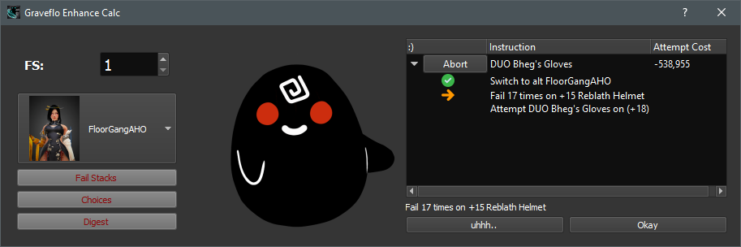

# BDO Enhancement Optimizer
I've throw together this fail stack calculator so that I could try out 
the new enhancement chance numbers that were released. I also wanted to 
get a more objective way to decide how to fail stack and enhance when 
considering multiple different pieces of gear at different enhancement levels.

I haven't spent too much time making or testing it. There are almost no comments in the 
code and there are probably spelling errors everywhere, but that is part 
of the reason I am posting up the code. So it isn't necessary to wait on me and you can alter it as you please.

<p align="center">
  
</p>
<p align="center">
  
</p>

## Future Plans
* More graphs
* Export to Excel
* Pull from online central market when implemented by PA
* Find Cron stone / force enhancement data tables

## How to Use
If you are unsure how to set up the environment see the \"Dependencies\" section below.
Make sure the directory that houses the code is in python path variable and run:
```
python.exe -m BDO_Enhancement_Tool
```

This will spawn the window and create a log file in the same directory as \"common.py\"

Start by making sure the prices are correct in the \"Monnies \\ MP\" tab.

Next enter your fails tacking gear \(reblath, rosar, etc.\) in the \"FS Gear\" section.

**Gear is entered at the TARGET level of enhancement. For example a +14 Reblath Helmet is entered at Level 15**

By the above you see that the highest level for all is PEN. This means that entering in PEN is a TET item because PEN is the target enhancement level. This makes less sense for fail stacking items, but for now this is how we enter gear.

After FS gear is entered, switch to the \"FS Cost\" tab and hit \"Refresh\". This should create a list of fail stacks. You can override an item on this list by selecting the row and clicking \"Change Item\".

Next enter your gear in the \"Equipment\" section and click \"Calculate Cost\" to get info on your gear relative to your fail stacking items. From this point on when you close the program it will save all you have done. When you start the program again it will automatically calculate up to this point.

Lastly, on the \"Strategy\" tab click \"Calculate\" to get a list of fail stacks and items. Click on items in the list to get a break down of cost and risk for each item.


## Dependencies
This project depends on several libraries and some libraries of 
my own. For this project to work the utilities and QtCommon module 
collection must be present. These are small versions of larger modules 
that I copied and cleaned for convenience.

See [requirements.txt](https://github.com/ILikesCaviar/BDO_Enhancement_Tool/blob/master/requirements.txt) for details:

* fuzzywuzzy==0.18.0
* numpy==1.19.0
* PyQt5==5.15.0
* PyQt5-sip==12.8.0
* python-Levenshtein==0.12.0
* urllib3==1.25.9


### Standard
* sys
* io
* types
* traceback
* operator 

### Versions
It is recommended to install Anaconda python distribution 2.7 for this 
project because that is how it was developed.

See: [Downloads | Anaconda](https://www.anaconda.com/download/)
```
> python --version
Python 3.7.6
> python -m conda --version
conda 4.8.3
```

## Methods
To be clear, I am not great at statistics so I highly encourage anyone 
who know what they are doing to critique the methods I am using to 
calculate. I detail the math here in the hopes that someone may destroy 
it \:\)

### Establishing Fail Stack Cost
The cost of a fail is an important factor in the calculation because it 
establishes a curve of value that equipment and opportunity cost rely on.

The essence of a fail stack cost at any level of fail stacks is the 
opportunity cost of acquiring another fail stack and the value of the 
current fail stack.

The opportunity cost pseudo code:
```
op_cost = black_stone_cost + (suc_rate * (last_cost + return_cost)) + (fail_rate * repair_cost)
```
Here, there is:
* black_stone_cost : Cost of black stone in one enhance attempt
* suc_rate : Probability of success enhancement
* last_cost : If this cost function of a fail stack \(F\) at position x then this is F\(x - 1\)
* return_cost : Cost to return the gear to how it was before the success. This is either cleanse cost or the cost of materials in the case of accessories (rely on cost class member in this case)
* reapir_cost : This is the cost to restore the gear after a fail
* See common.py -> simulate_FS

Since the opportunity cost is just the cost for the opportunity to 
gain a fail stack, we calculate the average amount of opportunities 
incurred before a fail is achieved. Now and hereafter the number of 
fails is calculated as the average number of fails:
```
avg_num_fails = 1.0 / suc_rate
```

Since for fail stacking we are counting the number of successes before a
failure we have:
```
avg_num_success = 1.0 / fail_rate
```

* See: https://math.stackexchange.com/questions/102673/what-is-the-expected-number-of-trials-until-x-successes

So the function \(F\) defined as, cost of gaining a fail stack, at fail 
stack position x :
```
F(x) = avg_num_success * op_cost
F(x) = avg_num_success * (black_stone_cost + (suc_rate * (F(x-1) + return_cost)) + (fail_rate * repair_cost))
```


### Calculating Enhancement Cost

The next step is to use the global fail stack cost curve to find the 
number of fail stacks for each gear such that the cost of enhancing at 
that number of fail stacks is minimized. Fail stacks get expensive 
quickly, almost needlessly so, an attempt at mitigating this issue is 
addressed next.

The method for calculating the price uses the same concept from before 
where an average number opportunities is calculated and then used with 
probabilities to compute an overall cost. The difference here is an 
a number of fails is calculated and the remainder is used as a number of 
successes. These are not integer values. The basic pseudo code for the 
enhancement cost of a piece of equipment at a particular fail stack:

```
avg_num_attempts = 1.0 / suc_rate
avg_num_fails = avg_num_attempts - 1

fails_cost = avg_num_fails * repair_cost
total_cost = fails_cost + cum_fs_cost + (black_stone_cost * avg_num_attempts)
```

Here we have:
* avg_num_attempts : The average number of attempts for one success
* avg_num_fails : The average number of attempts BEFORE one success
* fails_cost : The cost of failure
* cum_fs_cost : Cumulative cost of fail stacking to position x
* total_cost : The cost of the average number of fails and the one success

Notice here that the price of the fail stack is included in the success rate.
This may be obvious, but it is there so the max fail stack isn't chosen every time.
Here we have cumulative fail stack cost compared to repair cost.

What about gear that drops an enhancement level upon failure:

```
backtrack_start = lvl_map['TRI']

for i in range(0, 3):
    this_pos = backtrack_start + i
    prev_cost = min(total_cost[this_pos - 1])
    new_avg_attempts = 1.0 / suc_rate[this_pos - 1]
    new_num_fails = new_avg_attempts - 1
    new_fail_cost = repair_cost + prev_cost 
    total_cost[this_pos] = (new_num_fails * new_fail_cost) + (black_stone_costs[this_pos] * new_avg_attempts) + cum_fs_cost
```

This is just a loop starting at \"TRI\" which is \"DUO\" -> \"TRI\" that
factors in the previous gear cost upon failure. The cost formula is the 
came as above

Here we have:
* backtrack_start: An integer index where we start adding the previous cost
* this_pos: Position in the list of enhancement levels counter
* prev_cost: Cost of enhancing one level below
* new_avg_attempts: The average number of attempts for one success
* new_num_fails: The average number of attempts BEFORE one success
* cum_fs_cost: Cumulative cost of fail stacking to position x

Notice that this method needs to be different for accessories and the like.

### Calculating Enhancement Strategy
This needs an update. The previous explination does not represent the code anymore.

### Calculating Enhancement Probability

A quick note on the \"Strategy\" tab in the bottom right list of enhancing gear there is a probability on the far end
of the list. This probability is the chance of at least one success in n trials, where n is the average number or
trails to success. This probability helps determine a reasonable amount of fail stacks because it gives the confidence that
attempting the average number of trials will result in success.
* See [this article](https://en.m.wikipedia.org/wiki/Binomial_distribution) on the binomial distribution

## Files
Below are file definitions or descriptions of some of the files that this project uses.


### \*.log Files
Log files simply contain debug information that the program has output. 
Typically this file should not be altered by the user. These files 
should not be copied from one machine to another or it could make 
debugging the application harder. There is no maximum file size for 
these so if they get to big they can be deleted. That should not be a 
problem though

### settings.json
As the name would suggest this file is a JSON string that contains the 
programs settings. They can be safely edited with a text editor; be careful.
 If you really screwed up the settings file it can just be deleted. 
 The next time the program runs it will simply create a new settings 
 file with default values. The settings file is auto saved when the program 
 exits unless it crashes. This can be revised later. For now the path 
 is relative to the common import module and static. A command line 
 parameter should be used to supply the default loaded settings file in 
 the future. Below are a description of the fields:

Parameter | Default Value | Description
--- | --- | ---
fail_stackers | [] | List of gear objects on the fail stacking list
enhance_me | [] | List of gear objects on the enhancement list
r_fail_stackers | [] | List of gear objects removed from the fail stacking list
r_enhance_me | [] | List of gear objects removed from the enhancement list
fail_stackers_count | {} | Dictionary of indexes pointing to fail stacking items that specifies their count. If the value is encapsulated in a list it is in the removed list.
fs_exceptions | {} | Dictionary of fail stack indexes that corrispond to indexes of fail stack gear items
cost_conc_w | 2590000 | Cost of Conc stone (Weapon) (silver)
cost_conc_a | 1470000 | Cost of Conc stone (Armor) (silver)
cost_bs_w | 225000 | Cost of Black Stone stone (Weapon) (silver)
cost_bs_a | 220000 | Cost of Black Stone stone (Armor) (silver)
cost_cron | 2000000 | Cost of cron stone (silver)
cost_cleanse | 100000 |  Cost to clease gear from +15 to +14
cost_meme | 1740000 |  Cost of Memory Fragment
_version | None | Version information for change tracking

#### Gear Object
The gear object is a json string object that is encapsulated in the settings file.

Parameter | Description
--- | ---
name | A name for the piece of gear. 
cost | Cost of the base item, or cost of resetting an item after a fail attempt.
fail_dura_cost | For repairable items this is the amount of durability lost in failure.
enhance_lvl | String that denotes the level of enhancement, like \"PRI\"
gear_type | Corresponds to a file in the Data folder that describes it's enhancement levels and probabilities.
sale_balance | A balance that is added to the value of an item when fail stacking on enhancement success. For example sale price of TET minus price of DUO if purchased at DUO.
